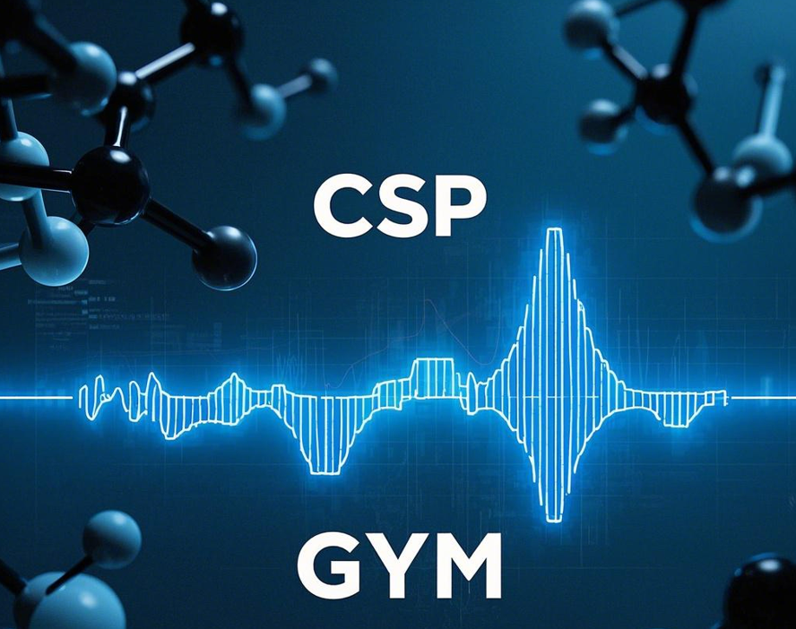

<h1>
<p align="center">
    
</p>
</h1>

<h4 align="center">


[](https://cspgym.tetean.com)
[](https://python.org/downloads)

</h4>
# CSP Gym: A Reinforcement Learning Environment for Crystal Structure Prediction

CSP Gym is a benchmark environment for applying reinforcement learning to crystal structure prediction (CSP). The goal is to find the lowest energy configuration of a crystal by adjusting lattice parameters and atomic positions.

## Installation

1. Clone the repository:
    ```bash
    git clone https://github.com/tetean/CSP-gym.git
    cd CSP_gym
    ```

2. Install dependencies:
    
    ```bash
    pip install uv
    uv venv .venv --python 3.10 
    source .venv/bin/activate
    uv pip install -e .
    ```

3. Usage

    See the `examples/train.py` script for an example of training a PPO agent using Stable-Baselines3.

4. Citation

    If you use CSP Gym in your research, please cite:

    ```
    @article{wang2025cspgym,
      title={CSP Gym: A Benchmark Reinforcement Learning Environment for Crystal Structure Prediction},
      author={Wang, Xiean},
      journal={TBD},
      year={2025}
    }
    ```
